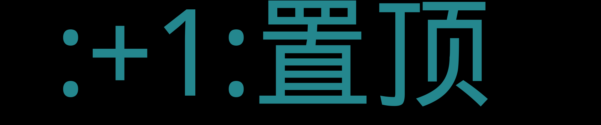

    
    
    
    
    
    
    
    

    

<a href='https://github.com/rdp-studio/ghiblog/issues/6#issuecomment-835581019'>
ghiblog - 方便易用的Github Issues博客系统。</a>'>
</a>

<a href="https://github.com/rdp-studio/ghiblog/issues/1">ghiblog - 方便易用的Github Issues博客系统。</a>

    
## 置顶 :thumbsup: 
- [RDPStudio团队（工作室）介绍](https://github.com/rdp-studio/ghiblog/issues/2)  0 :speech_balloon:  	 
- [此项目的ReadMe文件](https://github.com/rdp-studio/ghiblog/issues/1)  1 :speech_balloon:  	 
## 最新 :new: 

#### [计算机组成原理1 | 二进制编码：“手持两把锟斤拷，口中疾呼烫烫烫”？](https://github.com/rdp-studio/ghiblog/issues/8) 0 :speech_balloon: 	 2021-05-08 23:39:57

:label: : [</> 计算机组成原理](https://github.com/rdp-studio/ghiblog/labels/%3C/%3E%20%E8%AE%A1%E7%AE%97%E6%9C%BA%E7%BB%84%E6%88%90%E5%8E%9F%E7%90%86)

“锟斤拷”的来源是这样的。如果我们想要用 Unicode 编码记录一些文本，特别是一些遗留的老字符集内的文本，但是这些字符在 Unicode 中可能并不存在。于是，Unicode 会统一把这些字符记录为 U+FFFD 这个编码。如果用 UTF-8 的格式存储下来，就是\xef\xbf\xbd。如果连

[更多>>>](https://github.com/rdp-studio/ghiblog/issues/8)

---

#### [2021-05-08开发总结](https://github.com/rdp-studio/ghiblog/issues/7) 0 :speech_balloon: 	 2021-05-08 13:10:09

:label: : [:rocket: 日常](https://github.com/rdp-studio/ghiblog/labels/%3Arocket%3A%20%E6%97%A5%E5%B8%B8), [</> 编程](https://github.com/rdp-studio/ghiblog/labels/%3C/%3E%20%E7%BC%96%E7%A8%8B)

今天完成了整个ghiblog系统v1.0大版本的编写，目前没有bug，今天又是美好的一天！（虽然开发途中出现了一堆bug不过都在本地调试的没有提交）。

[更多>>>](https://github.com/rdp-studio/ghiblog/issues/7)

---

#### [封面](https://github.com/rdp-studio/ghiblog/issues/6) 3 :speech_balloon: 	 2021-05-08 10:57:26

:label: : [:framed_picture:封面](https://github.com/rdp-studio/ghiblog/labels/%3Aframed_picture%3A%E5%B0%81%E9%9D%A2)

这里的评论都将作为封面显示在博客中，请勿回复。

[更多>>>](https://github.com/rdp-studio/ghiblog/issues/6)

---

#### [GitHub-Trending-Crawler](https://github.com/rdp-studio/ghiblog/issues/5) 0 :speech_balloon: 	 2021-05-08 10:41:52

:label: : [开源](https://github.com/rdp-studio/ghiblog/labels/%E5%BC%80%E6%BA%90)

Crawling GitHub Trending Pages if you click star or run at actions page.

[更多>>>](https://github.com/rdp-studio/ghiblog/issues/5)

---

#### [发现一个在线下载油管视频的网站](https://github.com/rdp-studio/ghiblog/issues/4) 0 :speech_balloon: 	 2021-05-08 08:56:48

:label: : [:rocket: 日常](https://github.com/rdp-studio/ghiblog/labels/%3Arocket%3A%20%E6%97%A5%E5%B8%B8)

地址：[点我访问](https://yt1s.com/zh-cn)

[更多>>>](https://github.com/rdp-studio/ghiblog/issues/4)

---

## 分类  :card_file_box: 

    

        
        
:cloud: 词云 :cloud: 点击词云展开详细分类:point_down: 

    

:+1:置顶	2:newspaper:

- [RDPStudio团队（工作室）介绍](https://github.com/rdp-studio/ghiblog/issues/2)  0 :speech_balloon:  	 
- [此项目的ReadMe文件](https://github.com/rdp-studio/ghiblog/issues/1)  1 :speech_balloon:  	 

:framed_picture:封面	1:newspaper:

- [封面](https://github.com/rdp-studio/ghiblog/issues/6)  3 :speech_balloon:  	 

:rocket: 日常	2:newspaper:

- [2021-05-08开发总结](https://github.com/rdp-studio/ghiblog/issues/7)  0 :speech_balloon:  	 
- [发现一个在线下载油管视频的网站](https://github.com/rdp-studio/ghiblog/issues/4)  0 :speech_balloon:  	 

</> 编程	1:newspaper:

- [2021-05-08开发总结](https://github.com/rdp-studio/ghiblog/issues/7)  0 :speech_balloon:  	 

</> 计算机组成原理	1:newspaper:

- [计算机组成原理1 | 二进制编码：“手持两把锟斤拷，口中疾呼烫烫烫”？](https://github.com/rdp-studio/ghiblog/issues/8)  0 :speech_balloon:  	 

开源	2:newspaper:

- [GitHub-Trending-Crawler](https://github.com/rdp-studio/ghiblog/issues/5)  0 :speech_balloon:  	 
- [rdpmovy.js](https://github.com/rdp-studio/ghiblog/issues/3)  0 :speech_balloon:  	 

    

# 开源项目

| [GitHub-Trending-Crawler](https://github.com/rdp-studio/GitHub-Trending-Crawler) | Crawling GitHub Trending Pages if you click star or run at actions page. |    |
| --- | --- | --- |
| [rdpmovy.js](https://github.com/rdp-studio/rdpmovy.js) | rdpmovy.js is an easy-to-use animation engine based on three.js and gsap. |    |

